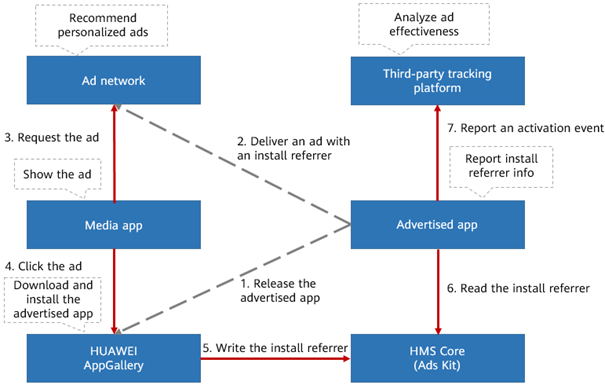
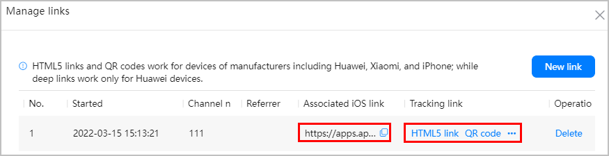

# huawei-referrer

This document contains instructions to retrieve install referrer from Huawei AppGallery on Huawei phones, it describes two methods which aren't well documented on Huawei official docs.

## Table of contents

- [huawei-referrer](#huawei-referrer)
  - [Table of contents](#table-of-contents)
  - [Obtain referrer when advertising (using ads-referrer SDK)](#obtain-referrer-when-advertising-using-ads-referrer-sdk)
    - [How does it work](#how-does-it-work)
    - [Implementation](#implementation)
    - [Testing](#testing)
  - [Obtain referrer without advertising](#obtain-referrer-without-advertising)
    - [How does it work](#how-does-it-work-1)
    - [Implementation](#implementation-1)
    - [Testing](#testing-1)
  - [References](#references)

## Obtain referrer when advertising (using ads-referrer SDK)

This method should be used when you advertise your app on Huawei Petal Ads platform, it requires integrating Huawei ads referrer SDK and creating Ads on Petal ads

### How does it work



1. You start by integrating Ads referrer SDK into your app, and then release it on AppGallery.
2. You deliver an app download ad with an install referrer in Petal Ads.
3. A publisher app requests and displays the ad.
4. A user clicks the ad in publisher app and choose to download and install your app.
5. AppGallery saves the install referrer.
6. When the user open your app, you should be able to obtain the install referrer and other metadata (e.g. install timestamp).

### Implementation

1.  add dependency: `implementation 'com.huawei.hms:ads-installreferrer:3.4.62.300`
2.  initialize referrer client and register a listener, example in an Activity class:

```kotlin
class MainActivity : ComponentActivity() {

    lateinit var mReferrerClient: InstallReferrerClient

    override fun onCreate(savedInstanceState: Bundle?) {
        super.onCreate(savedInstanceState)
        mReferrerClient = InstallReferrerClient.newBuilder(activity).setTest(false).build()
    }

    override fun onResume() {
        try {
            mReferrerClient.startConnection(installReferrerStateListener)
        } catch (e: Exception) {
            e.printStackTrace()
        }
    }

    override fun onStop() {
        try {
            mReferrerClient.endConnection()
        } catch (e: Exception) {
            e.printStackTrace()
        }
    }

    private val installReferrerStateListener = object : InstallReferrerStateListener {
        override fun onInstallReferrerSetupFinished(p0: Int) {
            Timber.d("install ref setup finished: $p0")
            if (p0 == InstallReferrerClient.InstallReferrerResponse.OK) {
                //connect to AppGallery, request referrer
                try {
                    val referrerInformation = mReferrerClient.installReferrer

                    val referrer = referrerInformation.installReferrer
                    val channel = referrerInformation.installChannel
                    val installTimestamp = referrerInformation.installBeginTimestampMillisecond
                    val clickTimestamp = referrerInformation.referrerClickTimestampMillisecond

                } catch (e: Exception) {
                    e.printStackTrace()
                }
            }
        }

        override fun onInstallReferrerServiceDisconnected() {
            //TODO()
        }
    }
}
```

### Testing

1.  publish an official release, or an [open testing](https://developer.huawei.com/consumer/en/doc/AppGallery-connect-Guides/agc-betatest-release-0000001071228673) version
2.  [create a test ad](https://developer.huawei.com/consumer/en/doc/promotion/ads-adtest-0000001190031279) on Petal Ads platform, click the Ad on Huawei phone and verify referrer information

## Obtain referrer without advertising

another method to obtain install referrer without advertising is using "attribution analysis", AppGallery app have contentProvider that can provide referrer information to your app (only), this API is part of AndroidOS and does not require any SDK

### How does it work

1. Add code to query referrer information from AppGallery using ContentResolver, then build and release your app on AppGallery.
2. Create a `badge link`, which is deep link with `referrer` and `channel` query parameters
3. Use the `badge link` in another app or website
4. A user invokes/clicks on the link and goes to AppGallery and chooses to download and install your app.
5. AppGallery saves the install referrer.
6. When the user open your app, you should be able to obtain the install referrer and other metadata (e.g. install timestamp).

### Implementation

1. Add the following code, which query the referrer information from AppGallery content provider (example in Activity class)

```kotlin
class MainActivity : ComponentActivity() {

    override fun onCreate(savedInstanceState: Bundle?) {
        super.onCreate(savedInstanceState)
        getInstallReferrer()
    }

    fun getInstallReferrer(): String {
        val PROVIDER_URI = "content://com.huawei.appmarket.commondata/item/5"
        val INDEX_ENTER_AG_TIME = 1
        val INDEX_INSTALLED_FINISH_TIME = 2
        val INDEX_START_DOWNLOAD_TIME = 3
        val INDEX_REFERRER_EX = 5


        var cursor: Cursor? = null
        val uri = Uri.parse(PROVIDER_URI)

        val packageName = arrayOf(packageName)
        try {
            cursor = contentResolver.query(uri, null, null, packageName, null)
            if (cursor != null) {
                cursor.moveToFirst()
                val storeVisitTime = cursor.getString(INDEX_ENTER_AG_TIME)
                val installTime = cursor.getString(INDEX_INSTALLED_FINISH_TIME)
                val downloadTime = cursor.getString(INDEX_START_DOWNLOAD_TIME)
                val referrer = cursor.getString(INDEX_REFERRER_EX)
                return referrer
            } else {

            }
        } catch (e: Exception) {
            e.printStackTrace()
            //Todo: handle the exception.
        } finally {
            cursor?.close()
        }
        return ""
    }

}
```

2. create a badge link as described here: https://developer.huawei.com/consumer/en/doc/AppGallery-connect-Guides/agdlink-getlink-agc-0000001164321881
3. in `Manage links` page, copy the deep link which can be found under column `Tracking link` (hidden after `QR code`)
   
4. publish to your deep link

### Testing

1. publish an official release, or an [open testing](https://developer.huawei.com/consumer/en/doc/AppGallery-connect-Guides/agc-betatest-release-0000001071228673) version of your app
2. invoke the deep link from in Huawei phone, install the app and verify referrer information

## References

1. Code samples: see `ReferrerHelper.kt`
2. Obtaining install referrer information: https://developer.huawei.com/consumer/en/doc/HMSCore-Guides/identifier-service-obtaining-installreferrer-sdk-0000001050066937
3. Creating badge link: https://developer.huawei.com/consumer/en/doc/AppGallery-connect-Guides/agdlink-getlink-agc-0000001164321881
4. attribution analysis: https://developer.huawei.com/consumer/en/doc/AppGallery-connect-Guides/agdlink-analysis-refer-0000001117762116
5. publish open test version: https://developer.huawei.com/consumer/en/doc/AppGallery-connect-Guides/agc-betatest-release-0000001071228673
6. create test ad on Petal ads: https://developer.huawei.com/consumer/en/doc/promotion/ads-adtest-0000001190031279
